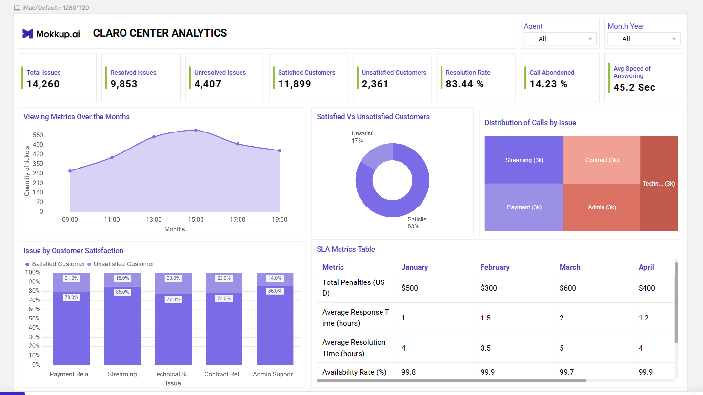

https://app.mokkup.ai/shared/7d71a550-4b59-4cb4-a9db-bd3611fefbb4/join

Análise das Informações e Conclusões das métricas SLA

Tempo de Resposta e Resolução:

Análise: O tempo de resposta médio diminui de 2 horas em março para 1.2 horas em abril, indicando uma melhora significativa na eficiência de atendimento inicial ao cliente. Entretanto, o tempo de resolução médio aumenta em março (5 horas), sugerindo dificuldades nesse mês, mas retorna a uma melhora por abril (4 horas).
Conclusão: Houve um esforço bem-sucedido para melhorar a rapidez do primeiro contato com os clientes, mas o aumento no tempo de resolução em março pode indicar complexidade nos problemas ou sobrecarga de suporte que deve ser mais investigado.

Taxa de Disponibilidade:

Análise: A taxa de disponibilidade permanece elevada, próxima de 99.9% por três meses, mostrando que o serviço foi consistente em manter a operação contínua.
Conclusão: A eficácia em manutenção da infraestrutura estável é um ponto forte do serviço, vital para faturamento e boa reputação.

Total de Chamadas:

Análise: O aumento das chamadas de janeiro a março, com um pico de 260 em março, seguido de uma queda em abril para 240, pode indicar um período de alta demanda ou problemas específicos que causaram mais aberturas de tickets.
Conclusão: Identificar o porquê do aumento em março pode ajudar a prever e preparar melhor recursos para flutuações futuras em demanda.

Satisfação do Cliente:

Análise: A satisfação cai em março, com a menor pontuação de 7.9/10, mas melhora novamente em abril com 9/10.
Conclusão: Melhoras em abril possivelmente resultam de ações corretivas subsequentes ao aumento do tempo de resolução em março. Investigar causas dessas variações mantém o cuidado na qualidade do serviço.

Penalidades Totais:

Análise: As penalidades aumentam em março para $600, potencialmente refletindo as dificuldades enfrentadas nesse mês (maior tempo de resolução e satisfação reduzida).
Conclusão: Trabalhar para minimizar questões que levam a penalidades é essencial para reduzir custos e manter cumprimento eficiente dos SLAs.
